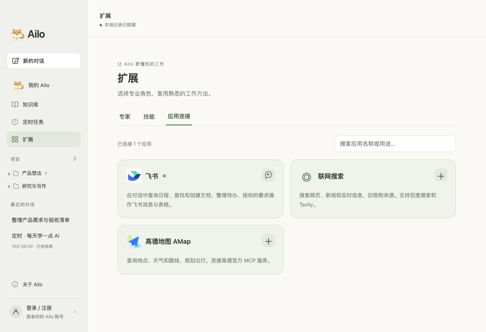
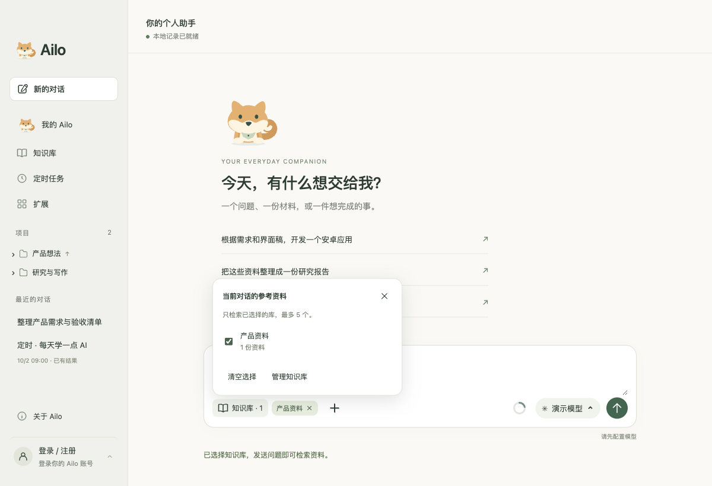
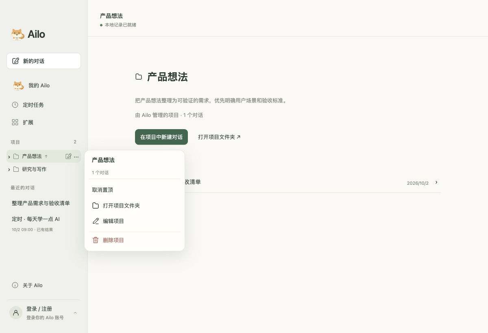
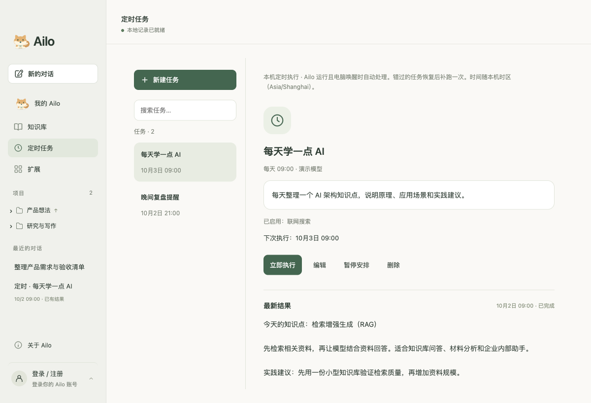
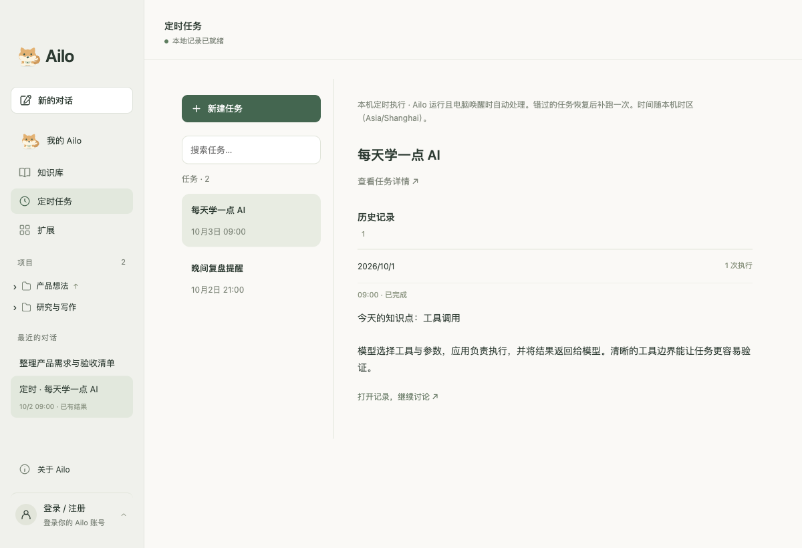
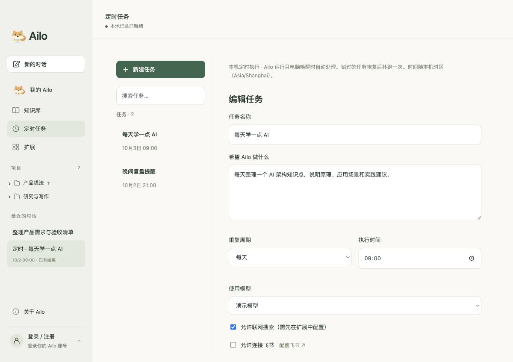

<p align="center">
  
</p>

<h1 align="center">Ailo</h1>

<p align="center">你的个人 Agent 助手，把问题、材料和想法变成下一步行动。</p>

<p align="center">
  <a href="https://github.com/ailearneryang/ailo/releases">下载安装</a> ·
  <a href="#界面预览">界面预览</a> ·
  <a href="#本地开发">本地开发</a> ·
  <a href="docs/macos-release.md">打包与发布</a>
</p>

Ailo 是一个以对话为入口的桌面 AI 助手。你可以让它整理材料、分析需求、规划项目，也可以选择专家和技能，按任务需要调用工具执行并查看成果。暖白与鼠尾草绿的界面，加上一只陪伴工作的柴犬，让日常工作更轻松。

**当前版本：0.1.64，macOS 开发预览版。** 已实现「我的 Ailo」持续助手会话、本地项目与对话管理、定时任务、材料读取、专家与技能、模型配置、本地知识库、高德地图 AMap MCP，以及第一版 Agent 执行循环。尚未实现云端账号同步；当前打包配置未启用 Apple 签名和公证。


## 你可以用 Ailo 做什么

| 能力 | 使用方式 |
| --- | --- |
| 我的 Ailo | 在持续的助手会话中讨论需求、委托工作，并查询或继续已有任务。 |
| 对话与项目 | 按项目组织工作，保存对话记录；支持项目置顶、编辑说明与默认专家、技能。 |
| 定时任务 | 按单次、每天或每周执行，查看进度、最新结果与按日期整理的历史记录。 |
| 材料理解 | 通过「+」添加本地文件，让 Ailo 读取材料、提炼需求并整理内容。 |
| 文件引用 | 输入 `@` 选择当前对话里的文件，快速带入后续讨论。 |
| 专家与技能 | 输入 `/` 搜索专家和技能；也可以在「扩展」中创建专家、编辑指令或导入 Markdown 技能。 |
| 任务执行 | 根据用户意图澄清问题、制定和调整计划，调用文件与命令工具，展示进度和成果。 |
| 自选模型 | 配置兼容 OpenAI Chat Completions 的服务地址、模型与自己的 API Key。 |
| 应用连接 | 按需配置飞书、联网搜索与高德地图 AMap，查询文档、实时信息、地点和路线。 |
| 本地知识库 | 导入 DOCX、Markdown 和文本资料，在对话中选择知识库，检索并引用相关原文。 |

可以从这些需求开始：

- 「把这些材料整理成一份研究报告，区分事实、推断和待确认的问题。」
- 「帮我梳理这个产品想法，列出需求范围和验收清单。」
- 「检查这个项目，先给出修改计划，再逐步执行和验证。」

执行效果取决于所选模型、材料内容、工具权限和本机环境。Android 开发是能力验证场景之一，目前不代表已完成通用 APK 交付验收。

## 界面预览

以下为真实应用界面，使用独立的演示项目与内置扩展截图，不含个人账号、真实对话或模型凭据。

### 在输入框中选择专家和技能

输入 `/` 弹出快捷菜单，支持名称与说明搜索、方向键选择、Enter / Tab 确认和 Esc 关闭。选中的专家、技能会显示为可移除标签；可同时使用 1 位专家与最多 5 个技能。


`@` 只引用当前对话中的文件；添加新的本地文件请使用「+」。没有文件时会显示「当前对话中暂无文件」。

### 管理你的专家与工作方法

在「扩展」中管理专家、技能和应用连接。内置产品经理、写作编辑、研究助手等角色，也支持自定义指令。当前技能导入以 Markdown 文字指令为主，不会自动执行技能包中的脚本。


### 连接应用与地图服务

在「扩展 → 应用连接」中配置飞书、联网搜索和高德地图。连接卡片使用统一背景，高德地图使用导航图标；连接成功后显示状态标记。



### 检索资料与选择知识库

在侧栏「知识库」中导入常用资料，输入关键词查找相关片段，并打开原文核对。


通过输入框「＋ → 知识库」添加参考资料。选中后可取消勾选、清空选择或点击标签上的「×」移除；全部移除后不再显示知识库标签。



## 下载与开始使用

1. 打开 [GitHub Releases](https://github.com/ailearneryang/ailo/releases)，查看已发布版本及其附件。
2. 如有 DMG 附件，下载后打开，将 Ailo 拖入「应用程序」。GitHub 自动生成的 **Source code** 压缩包是源码，不是安装包。
3. 启动 Ailo，在模型设置中填写自己的服务地址、模型名称和 API Key。
4. 新建对话，输入需求；需要材料时点「+」，需要专家或技能时输入 `/`。

当前版本 `0.1.64` 已在本地完成 Apple Silicon（M 系列 Mac）DMG 构建与磁盘映像校验，文件名为 `Ailo-0.1.64-mac-arm64.dmg`，约 154 MB。安装包需由维护者单独上传 Releases，推送源码不会自动发布安装包。Intel Mac、Windows 和 Linux 暂未完成安装验证。

当前安装包未完成 Developer ID 签名与 Apple 公证，macOS 可能阻止打开，适合先小范围内测。面向普通用户推广前需完成签名、公证与干净机器安装验证。基础桌面聊天不要求用户安装 Node.js 或 Rust；开发执行任务可能需要额外工具链。

## 数据与隐私

- 注册信息、对话记录、模型设置和连接凭据保存在本机应用数据目录中，不随源码或正常构建的安装包分发。
- 模型 API Key 使用 Electron `safeStorage` 加密保存；本机账号密码使用随机盐与 scrypt 哈希。
- 使用模型时，对话及相关材料内容会发送给你配置的模型服务商；启用搜索、飞书等连接后，相应请求也会发送给对应服务。**本地保存不代表所有处理都在本地完成。**
- 当前账号仅用于本机，不包含云端同步或邮箱验证；同一电脑的项目、对话和模型目前属于共享工作空间，不是按账号隔离的数据空间。
- `.local/`、运行时配置、环境变量文件、构建产物及私人参考材料已加入忽略规则。不要将个人数据、密钥或带令牌的链接提交到仓库。

## 我的 Ailo

左侧「我的 Ailo」是持续的助手会话。发送后直接在当前页面回复，离开或重启后仍可继续；「新的对话」保留为独立话题入口。普通讨论直接回答，执行委托创建关联的独立任务；卡片可打开进度、补充问题与成果。可在助手会话中查询任务进度、补充要求、继续或暂停已有工作。

明确时间和资料来源后，助手可创建或修改定时安排，使用同一份「定时任务」记录。助手会话和任务仍在本机保存；现已提供有来源的项目记忆和用户纠正，当前没有独立的个人偏好记忆系统或关机后的云端执行。自然语言识别与执行依赖所选模型，尚未完成真实模型下的全面验收。

## 项目管理

点击左侧项目名称进入项目首页，点击展开箭头查看项目内的对话。鼠标移到项目上可快速新建对话，点击「…」打开项目菜单。

- **置顶项目**：把常用项目放在项目列表前面，支持取消置顶。
- **编辑项目**：修改名称和项目说明，选择默认专家与技能（1 位专家、最多 5 个技能）。项目说明作为该项目对话的共同背景。
- **打开文件夹**：本地项目可直接打开关联的工作目录。
- **删除项目**：确认后删除项目及其对话记录，保留本地工作目录与文件；项目内有正在执行或排队的任务时无法删除。



## 定时任务

在左侧「定时任务」中创建任务，填写指令、选择模型，并设置单次、每天或每周执行。支持编辑、暂停安排、立即执行和删除。



### 查看结果与历史

- 每个任务有固定入口，显示最新结果、执行日期和状态。「最近的对话」按任务保留一条最新记录，避免同名记录重复堆积。
- 在任务详情中，历史记录按日期折叠；从结果对话顶部点击「历史记录」，直接打开并展开历史内容，无需再次点击。
- 执行中显示当前步骤或状态、已执行时间和最近更新时间，也可打开记录查看进度。结果与历史中的具体记录都可继续讨论。
- 每次执行保留独立会话，不自动接续上次执行上下文。最近 20 次保留完整执行状态，更早的会话仍按任务归属展示；旧记录仅在关联明确时归档。
- 删除定时安排后，已生成的对话仍保留，可从对话列表查看。



### 搜索与飞书

启用联网搜索前，需在「扩展」中配置搜索服务。勾选「允许连接飞书」后，任务使用已连接的飞书账号和权限；可通过「配置飞书」进入应用连接。需要确认的飞书写操作仍会请求人工处理。



### 执行规则

任务在本机保存和执行：Ailo 需要保持运行，电脑需处于唤醒状态。退出或休眠期间错过的任务，恢复后补跑一次，不逐次补跑；已经开始但被退出中断的执行会标记失败，不自动重放。每天和每周的时间按本机时区计算。

不同定时任务最多 3 个并发执行，超过上限时排队；同一个任务执行或排队期间不会重复运行。暂停安排只暂停后续定时执行，不停止当前任务。执行会消耗所选模型的用量；需要补充信息或人工授权时，请打开结果对话处理。

## 本地开发

技术栈：**Electron · React · TypeScript · Vite · Electron Forge**。

在 macOS 上安装 Node.js/npm 后：

```bash
git clone https://github.com/ailearneryang/ailo.git
cd ailo
npm ci --prefix apps/desktop
npm start
```

| 命令 | 用途 |
| --- | --- |
| `npm start` | 构建、打包并启动本机桌面应用。 |
| `npm run build` | 运行 TypeScript 检查与 Vite 生产构建。 |
| `npm run make:dmg` | 生成 macOS DMG，默认架构与构建机器相同。 |
| `npm run make:zip` | 生成应用 ZIP 备用包。 |

安装包输出在 `apps/desktop/out/make/`，版本来自 `apps/desktop/package.json`。签名、公证和上传 Releases 的步骤见 [macOS 发布说明](docs/macos-release.md)。

单元测试位于 `scripts/*.test.cjs` 与 `scripts/*.test.mjs`。桌面交互脚本使用 Playwright 和独立测试数据目录，可通过 `PLAYWRIGHT_MODULE` 指定模块路径。README 截图可通过 `node scripts/readme-screenshots.cjs` 重新生成（macOS，需要先构建并安装 Playwright）。

## 项目结构与文档

```text
apps/desktop/        桌面界面、主进程与本地存储
apps/desktop/agent/  Agent 执行循环、项目工作区与工具
scripts/             测试、构建及界面截图脚本
docs/                产品、能力边界与发布文档
docs/images/         README 界面截图
design/              早期界面草案
```

- [产品定位](docs/product-brief.md)
- [Agent 执行机制与限制](docs/agent-runtime.md)
- [桌面功能与验证记录](docs/desktop-preview.md)
- [飞书连接](docs/feishu-connection.md) / [联网搜索](docs/web-search.md)
- [macOS 打包与发布](docs/macos-release.md)

后续重点：真实模型下的完整任务验证、开发环境检测、签名与公证，以及云端账号与跨设备接续。路线规划不代表当前已提供这些能力。

### 外部目录只读授权

Agent 分析工作区外目录时，使用 `request_directory` 提交绝对路径与用途。Ailo 展示原生确认框并打开文件夹选择器；仅用户实际选中的目录获批，主进程验证可枚举后，将真实路径加入当前任务的命令沙箱读取规则。工作区外写入规则不变。授权仅在本次应用会话内有效，不跨重启保存。

等待时任务显示“等待目录授权”，成功后自动继续；取消或系统拒绝时保留计划，点击“继续任务”可重新申请。不提供授权入口的环境明确标记阻塞。`Operation not permitted` 本身不用于断定 TCC；已授权仍拒绝时引导检查对应系统权限和管理员策略。当前 Electron 分发未启用 macOS App Sandbox；未来启用或拆分执行 helper 时，需要实现 security-scoped bookmark 的生命周期与跨进程传递，不能只传路径字符串。

验证：`node --test scripts/directory-access.test.cjs scripts/agent.test.cjs scripts/execution-rounds.test.cjs`（实际隔离测试需允许启动 macOS `sandbox-exec`）。

### 高德地图 AMap MCP

扩展 → 应用连接 → 高德地图 AMap，填写高德开放平台 Key，点击“保存并测试”。通过官方 `https://mcp.amap.com/mcp` 的 Streamable HTTP 接入，支持初始化、会话头、工具发现与分页、JSON/SSE 响应、工具调用和取消；无需本地 Node.js 服务。Key 通过系统 safeStorage 加密保存在本机，不返回渲染进程或提供给模型。断开连接删除本机凭证并停止进行中的请求。

Agent 使用 `amap` 的 `list` 查看真实工具及参数，使用 `call` 查询地点、地址、天气、距离和路线，结果作为外部资料处理。已知只读地图查询无需额外确认，其他工具展示名称和完整参数供用户确认。工具名称不能凭空构造。连接测试只发现工具，不执行地图写入。

参考：[高德官方快速接入](https://lbs.amap.com/api/mcp-server/gettingstarted)、[创建应用和 Key](https://lbs.amap.com/api/mcp-server/create-project-and-key)。本版支持官方远程服务，不提供任意 MCP URL 或 stdio 配置。验证：`node --test scripts/amap-mcp.test.cjs` 使用模拟 MCP 服务；真实连接需用户在界面填写 Key 后测试。

### 本地知识库

侧栏“知识库”支持创建、编辑、导入、删除、关键词检索和分页原文预览。支持文字 PDF、XLSX、DOCX 正文与表格、Markdown 和 UTF-8 文本，单文件最多 20 MB、解析正文最多 200 万字符；每库最多 100 份资料，最多 30 个库。PDF 保留页码，XLSX 保留单元格和公式缓存值；扫描件需要 OCR，图片暂不支持。导入读取完整正文并建立中文双字/英文词索引，按 1200 字符切片、200 字符重叠；返回最多 6 个相关片段，使用内容哈希去重。导入失败逐文件报告。导入的是本地文本快照，原文件后续更改不会自动同步。

通过输入框“＋ → 知识库”选择当前对话使用的库（最多 5 个），选择随对话保存。选中后可从工具栏打开选择面板，取消勾选、清空选择或点击标签上的“×”移除；全部移除后，工具栏不再显示知识库标签，可从“＋”重新添加。“在对话中使用”会打开新对话并选择该库。Agent 通过 `knowledge list/search/read` 在所选范围内按需读取，以文件名、片段或字符位置标注引用；不把全库正文塞入上下文。检索为本地关键词检索，未接入向量模型；没有命中不等于资料不存在。资料仅在本机存储，读到的片段会发送到用户配置的模型服务。删除操作请求确认并仅移除 Ailo 副本，已有回答和上下文中的历史引用仍保留。

参考：[ChatGPT 项目与资料复用](https://learn.chatgpt.com/docs/projects)。验证：`node --test scripts/knowledge.test.cjs`，`node scripts/knowledge-smoke.cjs`（独立临时资料及桌面 UI，需允许启动 Electron 和本机调试端口）。

### 材料、成果与项目记忆增强

文字 PDF、Excel 可作为附件和知识库资料。产物栏支持 Markdown、PDF、Excel 和隔离 HTML 预览；可编辑文字或单元格、引用位置请求 AI 修改，并恢复上一版本。项目首页可查看任务记忆、保存纠正及移出来源，新对话参考同项目背景。OCR 与 VLM 扩展后置。范围、限制和验证见 [功能说明](docs/document-workflow.md)。

### 外观设置

点击左下角用户区域，在弹出菜单中选择“外观设置”，选择浅色、深色或跟随系统；提供暖白绿、简洁灰白和深色绿三个预设，以及纯色/柔和渐变背景、小/标准/大字体。修改立即生效，保存在本机，重新打开后沿用；“恢复默认”恢复暖白绿、跟随系统、纯色和标准字体。选择预设会应用对应模式，仍可再切换为跟随系统。文件预览保持内容本身的配色，主题不修改原文件。

宠物与陪伴：从左下角用户菜单进入，或在「我的 Ailo」点击「自定义宠物」。当前提供默认柴犬、显示开关、动画开关、实时预览与恢复默认；设置保存在本机，立即生效。关闭宠物后使用助手图标，动画遵循系统减少动态效果设置。
