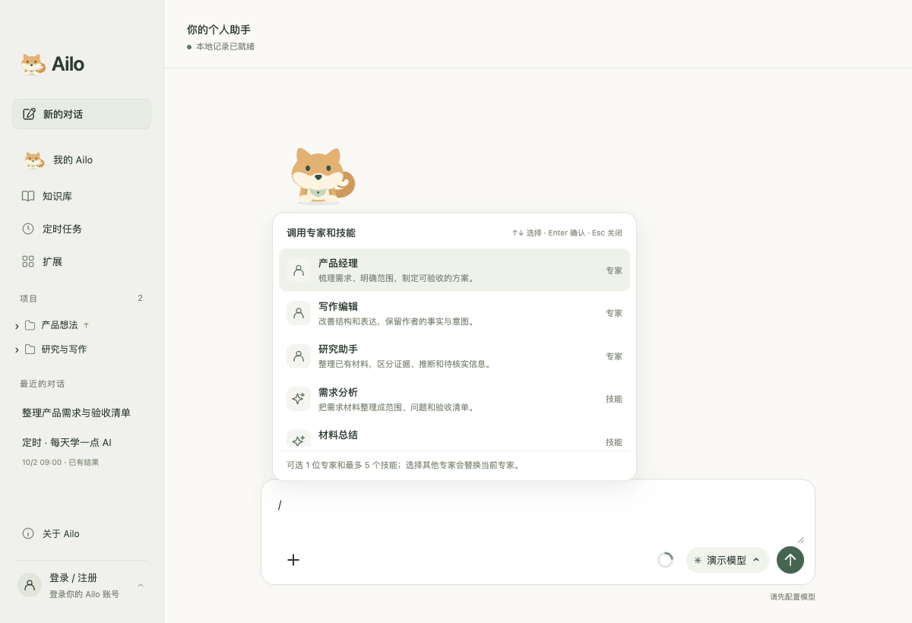
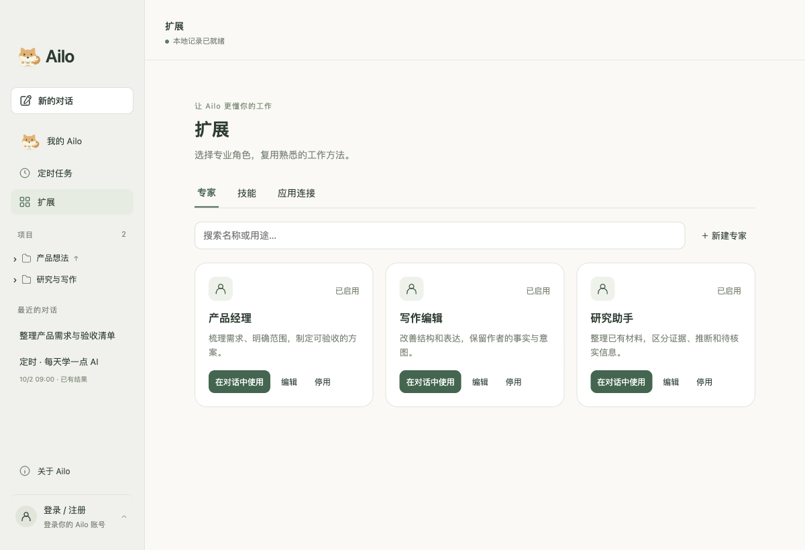

<p align="center">
  
</p>

<h1 align="center">Ailo</h1>

<p align="center">你的个人 Agent 助手，把问题、材料和想法变成下一步行动。</p>

<p align="center">
  <a href="https://github.com/ailearneryang/ailo/releases">下载安装</a> ·
  <a href="#界面预览">界面预览</a> ·
  <a href="#本地开发">本地开发</a> ·
  <a href="docs/macos-release.md">打包与发布</a>
</p>

Ailo 是一个以对话为入口的桌面 AI 助手。你可以让它整理材料、分析需求、规划项目，也可以选择专家和技能，按任务需要调用工具执行并查看成果。暖白与鼠尾草绿的界面，加上一只陪伴工作的柴犬，让日常工作更轻松。

**当前阶段：macOS 开发预览版。** 已实现本地项目与对话管理、材料读取、专家与技能、模型配置，以及第一版 Agent 执行循环。尚未实现云端账号同步；当前打包配置未启用 Apple 签名和公证。


## 你可以用 Ailo 做什么

| 能力 | 使用方式 |
| --- | --- |
| 对话与项目 | 按项目组织工作，保存对话记录，继续讨论已有任务。 |
| 材料理解 | 通过「+」添加本地文件，让 Ailo 读取材料、提炼需求并整理内容。 |
| 文件引用 | 输入 `@` 选择当前对话里的文件，快速带入后续讨论。 |
| 专家与技能 | 输入 `/` 搜索专家和技能；也可以在「扩展」中创建专家、编辑指令或导入 Markdown 技能。 |
| 任务执行 | 根据用户意图澄清问题、制定和调整计划，调用文件与命令工具，展示进度和成果。 |
| 自选模型 | 配置兼容 OpenAI Chat Completions 的服务地址、模型与自己的 API Key。 |
| 应用连接 | 按需配置飞书与联网搜索，在对话中启用对应连接。 |

可以从这些需求开始：

- 「把这些材料整理成一份研究报告，区分事实、推断和待确认的问题。」
- 「帮我梳理这个产品想法，列出需求范围和验收清单。」
- 「检查这个项目，先给出修改计划，再逐步执行和验证。」

执行效果取决于所选模型、材料内容、工具权限和本机环境。Android 开发是能力验证场景之一，目前不代表已完成通用 APK 交付验收。

## 界面预览

以下为真实应用界面，使用独立的演示项目与内置扩展截图，不含个人账号、真实对话或模型凭据。

### 在输入框中选择专家和技能

输入 `/` 弹出快捷菜单，支持名称与说明搜索、方向键选择、Enter / Tab 确认和 Esc 关闭。选中的专家、技能会显示为可移除标签；可同时使用 1 位专家与最多 5 个技能。



`@` 只引用当前对话中的文件；添加新的本地文件请使用「+」。没有文件时会显示「当前对话中暂无文件」。

### 管理你的专家与工作方法

在「扩展」中管理专家、技能和应用连接。内置产品经理、写作编辑、研究助手等角色，也支持自定义指令。当前技能导入以 Markdown 文字指令为主，不会自动执行技能包中的脚本。



## 下载与开始使用

1. 打开 [GitHub Releases](https://github.com/ailearneryang/ailo/releases)，查看已发布版本及其附件。
2. 如有 DMG 附件，下载后打开，将 Ailo 拖入「应用程序」。GitHub 自动生成的 **Source code** 压缩包是源码，不是安装包。
3. 启动 Ailo，在模型设置中填写自己的服务地址、模型名称和 API Key。
4. 新建对话，输入需求；需要材料时点「+」，需要专家或技能时输入 `/`。

本地已验证生成 Apple Silicon（M 系列 Mac）的 DMG；安装包需由维护者单独上传 Releases，推送源码不会自动发布安装包。Intel Mac、Windows 和 Linux 暂未完成安装验证。

当前安装包未完成 Developer ID 签名与 Apple 公证，macOS 可能阻止打开，适合先小范围内测。面向普通用户推广前需完成签名、公证与干净机器安装验证。基础桌面聊天不要求用户安装 Node.js 或 Rust；开发执行任务可能需要额外工具链。

## 数据与隐私

- 注册信息、对话记录、模型设置和连接凭据保存在本机应用数据目录中，不随源码或正常构建的安装包分发。
- 模型 API Key 使用 Electron `safeStorage` 加密保存；本机账号密码使用随机盐与 scrypt 哈希。
- 使用模型时，对话及相关材料内容会发送给你配置的模型服务商；启用搜索、飞书等连接后，相应请求也会发送给对应服务。**本地保存不代表所有处理都在本地完成。**
- 当前账号仅用于本机，不包含云端同步或邮箱验证；同一电脑的项目、对话和模型目前属于共享工作空间，不是按账号隔离的数据空间。
- `.local/`、运行时配置、环境变量文件、构建产物及私人参考材料已加入忽略规则。不要将个人数据、密钥或带令牌的链接提交到仓库。

## 我的 Ailo

左侧「我的 Ailo」是持续的助手会话。发送后直接在当前页面回复，离开或重启后仍可继续；「新的对话」保留为独立话题入口。普通讨论直接回答，执行委托创建关联的独立任务；卡片可打开进度、补充问题与成果。可在助手会话中查询任务进度、补充要求、继续或暂停已有工作。

明确时间和资料来源后，助手可创建或修改定时安排，使用同一份「定时任务」记录。助手会话和任务仍在本机保存；当前没有独立的个人记忆系统或关机后的云端执行。自然语言识别与执行依赖所选模型，尚未完成真实模型下的全面验收。

## 定时任务

在左侧「定时任务」中创建任务，填写指令、选择模型，并设置单次、每天或每周执行。支持编辑、暂停、立即执行和删除；每个任务通过固定入口查看最新结果，历史记录按日期折叠；「最近的对话」按任务保留一条最新执行记录，并显示日期和状态，避免同名记录重复堆积。可打开具体记录继续讨论。底层仍为每次执行保留独立会话，不自动接续上次执行上下文。最近 20 次执行状态有直接关联；更早的会话通过任务归属保留，旧记录仅在关联明确时归档。启用联网搜索前，需在「扩展」中配置搜索服务。勾选「允许连接飞书」后，任务使用已连接的飞书账号和权限；可通过「配置飞书」进入应用连接。需要确认的飞书写操作仍会请求人工处理。

任务在本机保存和执行：Ailo 需要保持运行，电脑需处于唤醒状态。退出或休眠期间错过的任务，恢复后补跑一次，不逐次补跑；已经开始但被退出中断的执行会标记失败，不自动重放。每天和每周的时间按本机时区计算。不同定时任务最多 3 个并发执行，超过上限时排队；同一个任务执行或排队期间不会重复运行，执行会消耗所选模型的用量。需要补充信息或人工授权时，请打开结果对话处理。

## 本地开发

技术栈：**Electron · React · TypeScript · Vite · Electron Forge**。

在 macOS 上安装 Node.js/npm 后：

```bash
git clone https://github.com/ailearneryang/ailo.git
cd ailo
npm ci --prefix apps/desktop
npm start
```

| 命令 | 用途 |
| --- | --- |
| `npm start` | 构建、打包并启动本机桌面应用。 |
| `npm run build` | 运行 TypeScript 检查与 Vite 生产构建。 |
| `npm run make:dmg` | 生成 macOS DMG，默认架构与构建机器相同。 |
| `npm run make:zip` | 生成应用 ZIP 备用包。 |

安装包输出在 `apps/desktop/out/make/`，版本来自 `apps/desktop/package.json`。签名、公证和上传 Releases 的步骤见 [macOS 发布说明](docs/macos-release.md)。

单元测试位于 `scripts/*.test.cjs` 与 `scripts/*.test.mjs`。桌面交互脚本使用 Playwright 和独立测试数据目录，可通过 `PLAYWRIGHT_MODULE` 指定模块路径。README 截图可通过 `node scripts/readme-screenshots.cjs` 重新生成（macOS，需要先构建并安装 Playwright）。

## 项目结构与文档

```text
apps/desktop/        桌面界面、主进程与本地存储
apps/desktop/agent/  Agent 执行循环、项目工作区与工具
scripts/             测试、构建及界面截图脚本
docs/                产品、能力边界与发布文档
docs/images/         README 界面截图
design/              早期界面草案
```

- [产品定位](docs/product-brief.md)
- [Agent 执行机制与限制](docs/agent-runtime.md)
- [桌面功能与验证记录](docs/desktop-preview.md)
- [飞书连接](docs/feishu-connection.md) / [联网搜索](docs/web-search.md)
- [macOS 打包与发布](docs/macos-release.md)

后续重点：真实模型下的完整任务验证、开发环境检测、签名与公证，以及云端账号与跨设备接续。路线规划不代表当前已提供这些能力。
